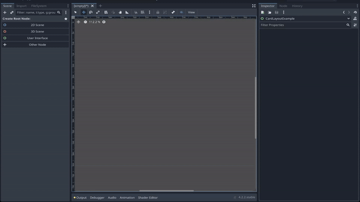
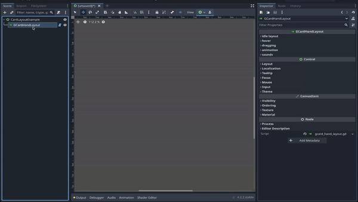
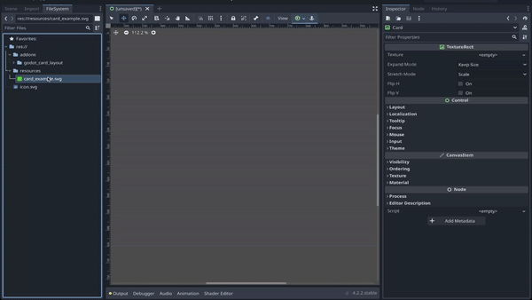
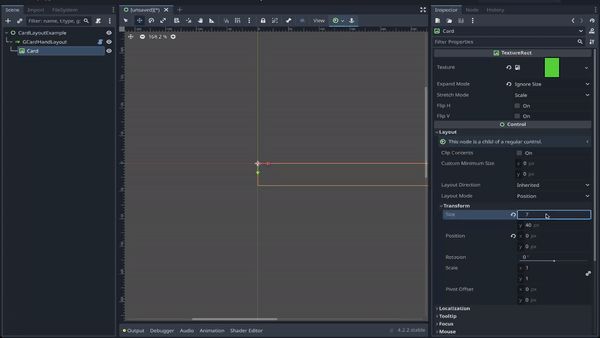
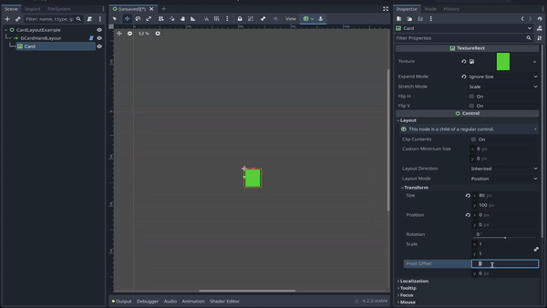
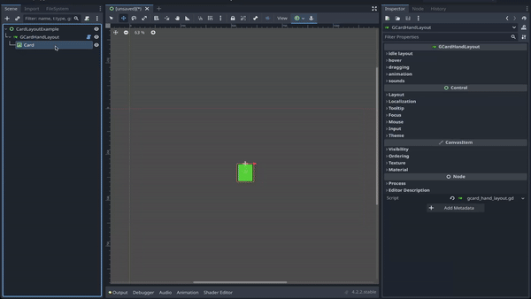

# Tutorial

If you have not installed the plugin yet, please follow the [Installation Guide](./INSTALLATION.md) to install the plugin first.

## Quick Start
1. Create an empty Control node scene. Add `GCardHandLayout` as a child.

 

2. Create a `TextureRect` node as a card. Add it as a child node of the `GCardHandLayout`. Add some texture so the "Card" is visible.

 

3. Customize the card. In this Quick Start Guide, we added a simple texture to represent the card. Set the size to **Vector2(80, 100)**.

 
 

4. **Important**: For the layout to work properly, the x value of the pivot offset of the card node must be set to half of the card's width. In this example, we set the pivot offset to **Vector2(40, 0)**.

 

5. Add more cards to see them laying out in a hand layout!

 

Now that the basic hand layout is set up, feel free to adjust the parameters in the `GCardHandLayout` to configure the layout as you see fit.
